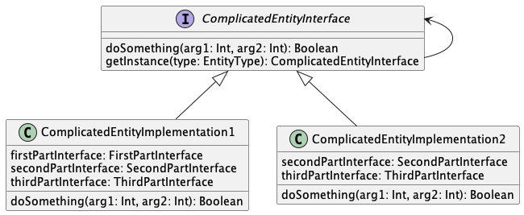
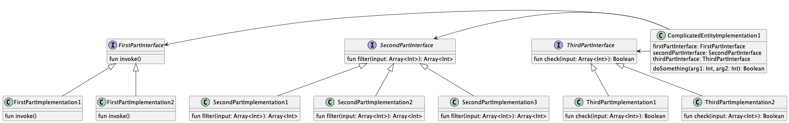
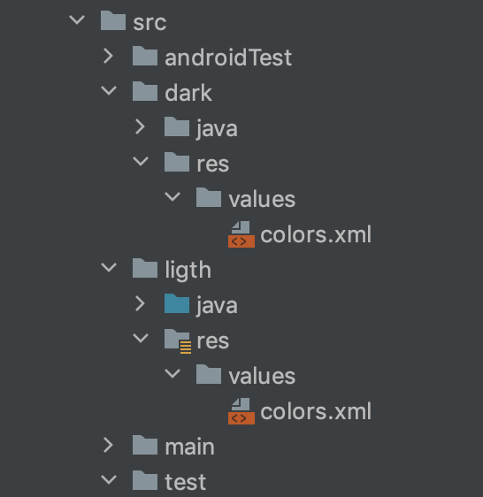

# Test task:
Please create structural and architectural plan of application with following requirements:
1. App contains NavigationView with several fragments. Some of the fragments should contain nested fragments in FragmentPager.
2. All fragments should communicate with each other on certain event (for ex. Login status change)
3. App should contain separate activity working with some data entity (let’s call it ComplicatedObject) with complicated logic, which contains lots of parts. Parts can be set on and off by different conditions based on data in corresponding ComplicatedObject. Also each part has it’s own logic branching based on ComplicatedObject. Please provide a structure to keep this activity clean, understandable and functional.
4. App style should be easy customizable by flavoring.
5. App logic could alter based on flavor.
6. App should be based on MVVM architecture
7. Please describe possible bottle-necks and problematic places which can occur while implementing this logic and provide code snipets of handling this issues. Feel free to provide code examples of other parts of your solution, that would be a plus.
8. Please also provide some of the classes you’ve developed earlier to check your general codestyle.
9. Please solve one or both of given challenges, and send us your solution:<br/>
https://www.hackerrank.com/challenges/prime-checker/problem<br/>
https://www.hackerrank.com/challenges/java-dequeue/problem<br/>

# Solutions

1. [BaseActivity.kt](app/src/main/java/com/hardway/gdtest/ui/activities/BaseActivity.kt) contains [initToolbar()](https://github.com/VoropayAndrey/GDTestApp/blob/1c5eb796ebac1061635b12d69a38425a00a4c7cd/app/src/main/java/com/hardway/gdtest/ui/activities/BaseActivity.kt#L31) method to setup application Toolbar and NavigationView.
[SlashBaseFragment.kt](https://github.com/VoropayAndrey/GDTestApp/blob/1c5eb796ebac1061635b12d69a38425a00a4c7cd/app/src/main/java/com/hardway/gdtest/ui/fragments/SlashBaseFragment.kt#L30) contains two nested fragments.

2. To be able to communicate with fragments an [event bus](app/src/main/java/com/hardway/gdtest/domain/LoginEventBus.kt) was introduced in the application.
The event bus is based on MutableSharedFlow which act as BehaviorSubject from RxJava.
Any number of fragments or any other object can start to listen of events, for example:
```kotlin
getSharedViewMode().contactsLiveData.observe(viewLifecycleOwner, Observer {
    Log.d(Constants.TAG, "ContactsFragment, login state change, isLoggedIn: ${it.isLoggedIn}")
})
```
Given ViewModel is shared between all fragments.


3. Because the ComplicatedObject has a lot of smaller pieces it would be nice to create a factory for ComplicatedObjects.
In this case Factory Method design pattern is suited well.

<p align="center">
  
</p>


We will need to change only one class to add new implemntation of ComplicatedEntityInterface.

For the smaller parts some kind of strategy pattern is proposed.
Each of the parts has it own interface and a set of implementation that can be changed based on the processed data.

<p align="center">
  
</p>

4. Flavorign is added to the application level gradle file:
[Here](https://github.com/VoropayAndrey/GDTestApp/blob/1c5eb796ebac1061635b12d69a38425a00a4c7cd/app/build.gradle#L42)
This flavoring will change the colors of the app based on the app structure:

<p align="center">
  
</p>

5. Different project flavor has it own implmenetation of ComplicatedEntityInterface [ComplicatedEntityImplementation1](app/src/dark/java/com/hardway/gdtest/domain/entities/ComplicatedEntityImplementation1.kt) and [ComplicatedEntityImplementation2](app/src/dark/java/com/hardway/gdtest/domain/entities/ComplicatedEntityImplementation2.kt).

6. Currently the app has 4 different ViewModel.
Each view model is instantiated by viewModels() using Dagger2/Hilt to inject dependencies to the ViewModels.

7. Bottle necks
- To receive an event for the event bus a fragment should be visible and active;
- The event bus is okay for small project, but it's hard to debug in larger projects;
- Each product flavor requires its own copy of packages and classes, it will be a bit more difficult to change interfaces;
- Each part of complicated object can be represented by a Wrapper:
````kotlin
    var partInterface: PartInterface  = FirstPartImplementation1(SecondPartImplemetation2(ThirdPartImplemetation3()))
    
    var partInterface: PartInterface = ThirdPartImplemetation3(SecondPartImplemetation2(FirstPartImplementation1()))
````
The interface, arguments and returned data can be unified between them.
This will allow to change sequence of data filtering, checking, processing, logging and so on.


8. Feel free to browse my public repositories:<br/>
https://github.com/VoropayAndrey<br/>
https://gitlab.com/voropayandrey<br/>

Any other source code is intellectual-property of my clients protected by Non Disclosure Agreement.

9. Challenges:

9.1. Prime problem:
Description:
https://www.hackerrank.com/challenges/prime-checker/problem

Solution:
[PrimeChecker.java](app/src/test/java/com/hardway/gdtest/PrimeChecker.java)

````java
class Prime {
    public String checkPrime(Integer... numbers) {

        String output = "";
        for(Integer number:numbers) {
            if (number > 1) {
                if(number > 2) {
                    for (int i = 2; i < number; ++i) {
                        if (number % i == 0) {
                            output += ' ';
                        } else {
                            output += number;
                        }
                        break;
                    }
                } else {
                    output += number;
                }
            } else {
                output += ' ';
            }
        }
        return output;
    }
}
````

9.2. Dequeue problem:
Description:
https://www.hackerrank.com/challenges/prime-checker/problem

Solution:
[JavaDequeue.java](app/src/test/java/com/hardway/gdtest/JavaDequeue.java)

````java
public void test() {
    Scanner in = new Scanner("6 3\n" +
            "5 3 5 2 3 2");
    Deque deque = new ArrayDeque<Integer>();
    int n = in.nextInt(); // Array length
    int m = in.nextInt(); // Subarray length

    for (int i = 0; i < n; i++) {
        int num = in.nextInt();
        deque.add(num);
    }

    ArrayList subarray = new ArrayList(3);
    subarray.ensureCapacity(3);
    int numberOfSubArrays = (n - m) + 1;

    for(int i = 0; i < numberOfSubArrays; i++) {
        Iterator<Integer> iterator = deque.iterator();
        for(int j = 0; j < m; j++) {
            subarray.add(j, iterator.next());
        }
        deque.removeFirst();
    }
}

public int getUnique(ArrayList array) {
    HashSet<Integer> set = new HashSet<Integer>(array);
    return set.size();
}
````
